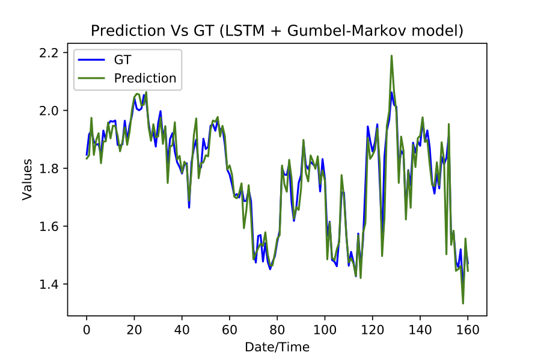
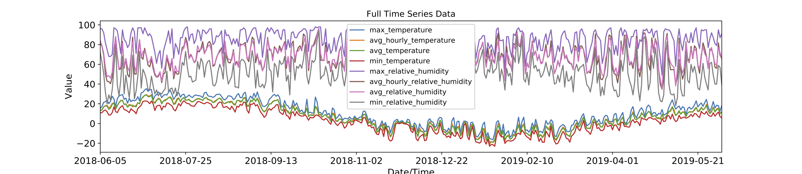

# Forecasting Maxima in Climate Time Series
 [Israel Goytom](http://isrugeek.github.io), [Kris Sankaran](http://krisrs1128.github.io/personal-site)

 
[Project](https://github.com/isrugeek/climate_extreme_values) | [Paper](.)


<!--  -->



#### Abstract
Climate change is already altering the prob- abilities of weather hazards. Accurate prediction of cli- mate extremes can inform effective preparation against weather-induced stresses. Forecasting extreme weather events accurately is a task that has attracted interest for many years. Classical and, to a lesser extent, machine learning-based approaches have handled this issue; how- ever, such systems are hard to tune or scale. While the prediction of extremes has been the subject of investiga- tion across several communities, including meteorology, machine learning, and statistics, it has been subject to far less scrutiny than the prediction of conditional means. In this work, we offer a systematic comparison of existing approaches on a pair of common tasks, maximum temper- ature and precipitation prediction. Further, motivated by this comparison, we propose a method to predict maxima in time series that unifies deep learning with extreme value theory

#### A Pytorch implmentation for Forecasting Maxima in Climate Time Series

### Dataset
**Note**: Please Download the dataset file from [climate.weather.gc.ca](climate.weather.gc.ca), [Kaggle](https://kaggle.com/c/short-term-load-forecasting-challenge/data) or 
          [Subseasonal Dataset](https://dataverse.harvard.edu/dataset.xhtml?persistentId=doi:10.7910/DVN/IHBANG)


## A recipe to get started

### Prerequisites
- Linux or OSX
- NVIDIA GPU + CUDA CuDNN (CPU mode and CUDA without CuDNN may work with minimal modification, but untested)

- Clone this repo:
```bash
git clone https://github.com/isrugeek/climate_extreme_values
cd climate_extreme_values
```


#### Setup python enviroment 
- to install python packages `requirements.txt`

```bash
pip install -r requirements.txt
```


Make sure to follow [This](https://github.com/paulo-o/forecast_rodeo)  to prepare the dataset, if you are using the Subseasonal dataset.

- If you are using the *Kaggle* dataset you need to interpolate using `interpolate.R`

Run the code from the main directory which the README.md is located

#### Train model

-Train using train_main.py by adding suffix which model you want to train eg.`python train_main.py LSTM` for LSTM the three options are : LSTM, GULSTM, ENCDEC

#### Test Model
-Forecast using forecaster.py 

`main.ipynb` is an interactive notebook to test the forecaster.


 **Note:** *This project is still under development*